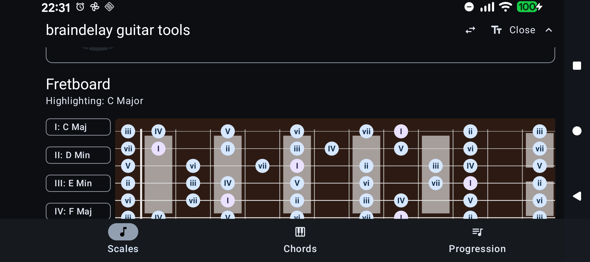

# Braindelay Guitar Tools

<table>
<tr>
<td></td>
<td>An Android app for guitarists learning scales, chord voicings, and progressions. Visualise any scale on a 19-fret fretboard, explore diatonic chord shapes, and build chord progressions with audio playback.</td>
</tr>
</table>

---

## Screenshots

<table>
<tr>
<td align="center"><br><em>Root &amp; Scale selector</em></td>
<td align="center"><br><em>Fretboard — C Major scale</em></td>
</tr>
<tr>
<td align="center"><br><em>Voicing type picker</em></td>
<td align="center"><br><em>Chord tone overlay (R / 3 / 5 / 7)</em></td>
</tr>
<tr>
<td align="center"><br><em>Chords screen — voicing diagrams</em></td>
<td align="center"><br><em>Progression builder</em></td>
</tr>
</table>

---

## Usage Guide

### Scales


1. **Choose a root note** — tap any of the 12 chromatic notes in the Root & Scale card.
2. **Choose a mode** — tap a mode chip (Major, Minor, Dorian, Harmonic Minor, etc.).
3. The fretboard updates immediately, showing every scale note labelled with Roman numeral degrees (I–VII). Root notes appear in a distinct colour.
4. **Collapse the selector** — tap the arrow in the top bar to hide the Root & Scale panel and focus on the fretboard. Tap again to restore it.

#### Fretboard options (top bar icons)
| Icon | Action |
|------|--------|
| ⇄ (SwapHoriz) | Toggle **left-handed mode** — mirrors the fretboard so the nut is on the right |
| T (TextFields) | Toggle **label mode** — switches note labels between Roman numerals (I, b3…) and note names (C, C#…) |

#### Chord voicings


- A scrollable panel to the left of the fretboard lists 10 voicing types (Major Triad, Minor Triad, Dom 7 Shell, etc.).
- **Select a voicing type**, then **tap any highlighted note** on the fretboard to overlay that chord's tones (colour-coded R / 3 / 5 / 7).


- Tap **▶** (Play) to hear the chord via synthesised audio.
- Diatonic voicings for the tapped note are marked with an ⓘ icon.
- Tap the same voicing chip again, or press **Clear**, to reset the overlay.

#### Arpeggio overlays
- In the **Diatonic Chords** card, tap any chord chip (e.g. "II: D Min") to highlight the full 1-3-5-7 arpeggio of that chord across the entire fretboard.
- A summary card shows the chord name, quality, and constituent notes.
- Tap the chip again or press **Clear** to remove the overlay.

#### Fullscreen mode
- Tap anywhere on the fretboard that is **not** a highlighted note to enter fullscreen zoom.
- Tap **Go Back** to return to the normal view.

---

### Chords


The Chords screen is landscape-only.

1. **Tap a note** on the circle (left panel) to set the root.
2. The right panel shows all 16 chord types at once — scroll vertically to browse them.
3. Each chord type section contains a horizontally scrollable row of voicing diagrams covering up to 3 octave positions.
4. **Tap any diagram** to hear it played back.

---

### Progression


The Progression screen is landscape-only.

#### Building a progression
1. In the right panel, select a **chord type** from the scrollable chip list.
2. Tap a **note** on the circle to set the root.
3. Press **Add** to append the chord to the progression list (left panel).
4. Repeat to build up a sequence. Use the **← →** arrows to reorder chords and **✕** to delete one.

#### Playback
1. Set the **BPM** with the slider (20–240). Each chord plays for 4 beats at the chosen tempo.
2. Press **▶** to start looping through the progression. The active chord is highlighted.
3. Adjust the BPM slider at any time — the new speed takes effect on the next chord.
4. Press **⏸** to stop.

---

## Building

```bash
# Debug APK
./gradlew assembleDebug

# Release APK
./gradlew assembleRelease

# Unit tests
./gradlew test

# Lint
./gradlew lint
```

Requires Android Studio with min SDK 24 / target SDK 36.
