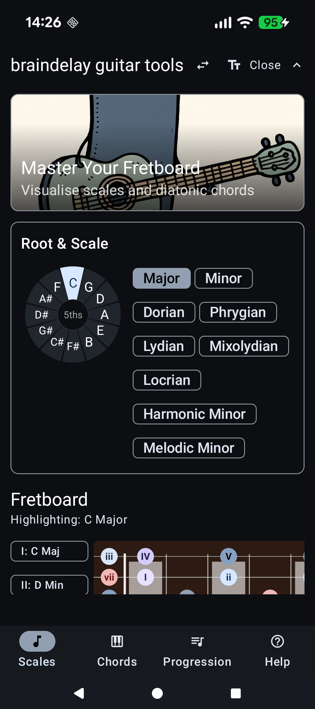
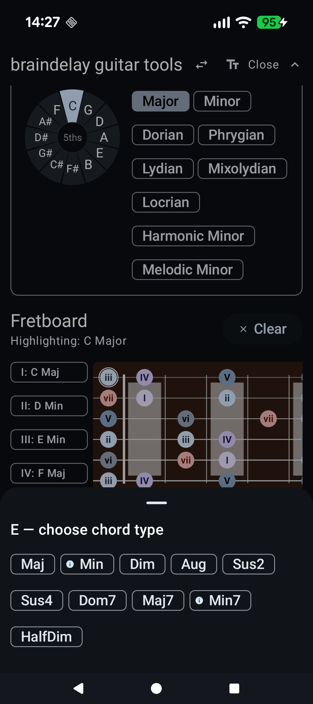
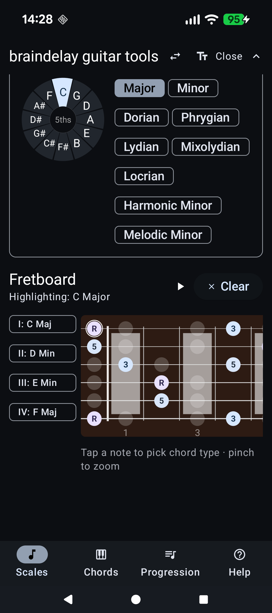
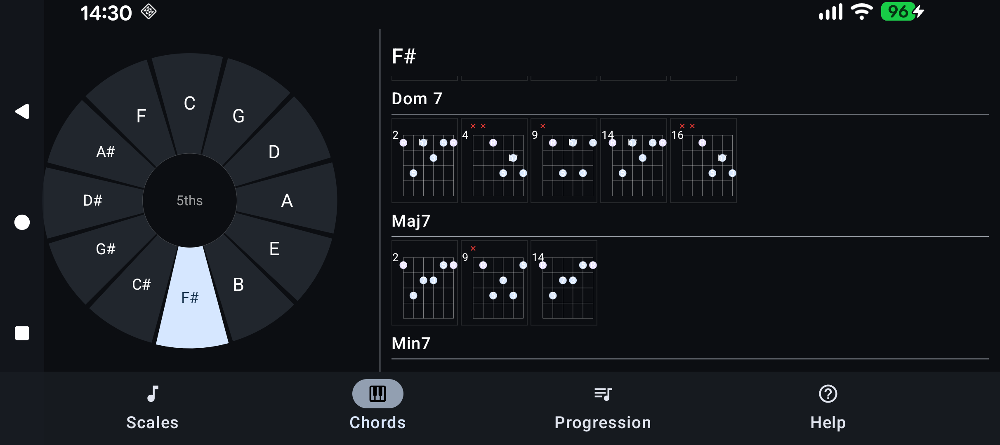
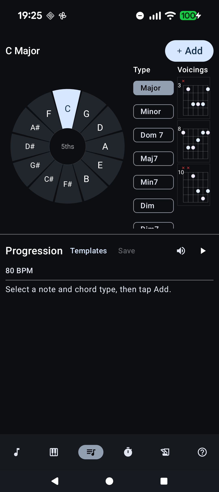
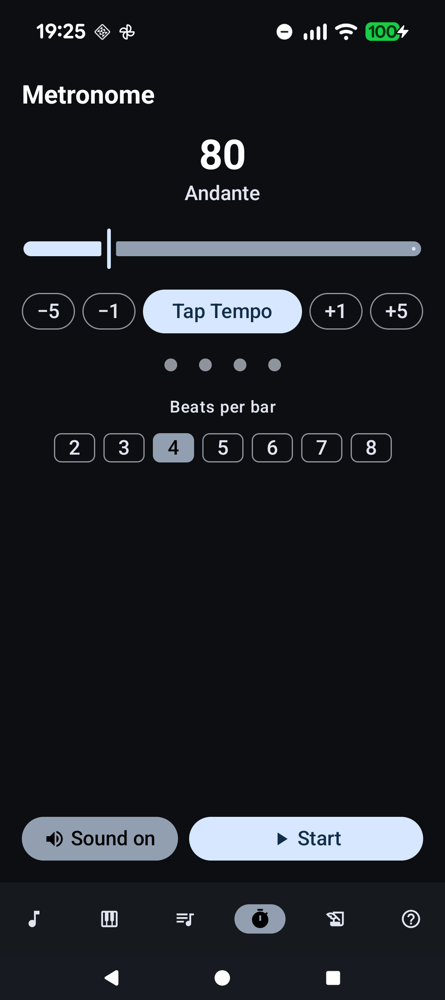
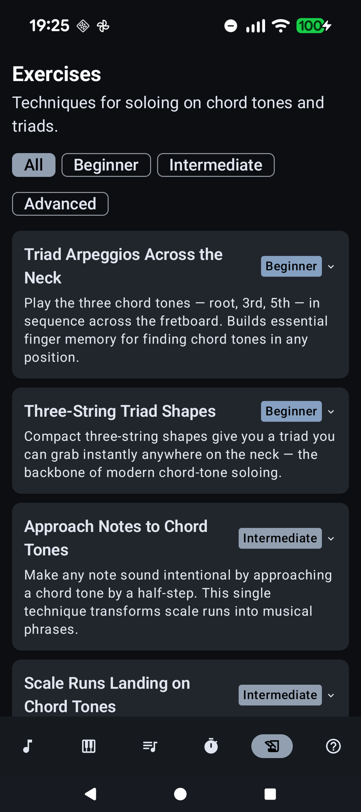

# Braindelay Guitar Tools

A tool to help guitarists learn scales, chord voicings, and progressions. Visualise any scale on a 19-fret fretboard, explore diatonic chord shapes, build chord progressions with audio playback, keep time with the built-in metronome, and work through structured soloing exercises.

## Usage Guide

### Scales

1. **Choose a root note** — tap any of the 12 chromatic notes in the Root & Scale card.
2. **Choose a mode** — tap a mode chip (Major, Minor, Dorian, Harmonic Minor, etc.).
3. The fretboard updates immediately, showing every scale note labelled with Roman numeral degrees (I–VII). Root notes appear in a distinct colour.
4. **Collapse the selector** — tap the arrow in the top bar to hide the Root & Scale panel and focus on the fretboard. Tap again to restore it.

#### Fretboard options (top bar icons)
| Icon | Action |
|------|--------|
| ⇄ | Toggle **left-handed mode** — mirrors the fretboard so the nut is on the right |
| T | Toggle **label mode** — switches note labels between Roman numerals (I, b3…) and note names (C, C#…) |

#### Chord voicings

- **Tap any highlighted note** on the fretboard to open a chord type picker at the bottom of the screen.

- Select a chord type to overlay its tones on the fretboard (colour-coded R / 3 / 5 / 7).

- Tap **▶** (Play) to hear the chord via synthesised audio.
- Diatonic chord types for the tapped note are marked with a dot (●).
- Press **Clear**, or tap outside the picker, to reset the overlay.

#### Arpeggio overlays
- In the **Diatonic Chords** card, tap any chord chip (e.g. "II: D Min") to highlight the full 1-3-5-7 arpeggio of that chord across the entire fretboard.
- A summary card shows the chord name, quality, and constituent notes.
- Tap the chip again or press **Clear** to remove the overlay.

#### Fullscreen mode
- Tap anywhere on the fretboard that is **not** a highlighted note to enter fullscreen zoom.
- Tap **Go Back** to return to the normal view.

---

### Chords

In portrait, the circle of fifths sits at the top and the chord list fills the lower half. In landscape, they sit side by side.

1. **Tap a note** on the circle of fifths to set the root.
2. The chord list shows all 16 chord types — scroll vertically to browse them.
3. Each chord type section contains a horizontally scrollable row of voicing diagrams.
4. **Tap any diagram** to hear it played back.

---

### Progression

The chord selector shows the circle of fifths on the left, chord type chips in the middle, and example voicings on the right. In portrait the selector and progression list are stacked; in landscape they sit side by side.

#### Building a progression
1. **Tap a note** on the circle of fifths to set the root.
2. **Select a chord type** from the chip list.
3. Press **Add** to append the chord to the progression list.
4. Use **− / +** to adjust how many beats each chord lasts (1–8).
5. Use the **← →** arrows to reorder chords and **✕** to delete one.

#### Templates
- Tap **Templates** to open a sheet of preset progressions. Templates resolve against the key currently set in the Scales screen.
- Select a template to preview the chord sequence, then press **Load** (replaces current) or **Append** (adds to the end).
- Templates named after exercises — e.g. "Approach Notes (I–IV–V)" — are designed to be used alongside those exercises.

#### Saved progressions
- Tap **Save** to name and save the current progression.
- Tap **Saved** to expand the saved list. Tap an entry to load it; long-press to rename; tap **✕** to delete.

#### Playback
1. The current BPM is set on the **Metronome** screen and shown above the progression list.
2. Press **▶** to start looping. The metronome starts automatically at the same tempo. The active chord is highlighted.
3. Press **⏸** to stop — the metronome stops at the same time.
4. While playing, switch to the **Scales** tab to see the chord arpeggios highlighted on the fretboard in real time.
5. The fretboard also previews the **next** chord one beat early so you can see what is coming.

---

### Metronome

A standalone click track that also drives Progression playback tempo. Any BPM change here is immediately reflected when the Progression loops.

#### Setting the tempo
- **Drag the slider** to set BPM (20–300). The Italian tempo name (Largo, Andante, Allegro…) updates automatically.
- Use **−5 / −1 / +1 / +5** for precise nudges.
- Tap **Tap Tempo** in rhythm to derive the BPM from your playing. Three or more taps average out to a stable tempo.

#### Beat display
- Animated dots show each beat. The **downbeat (beat 1)** pulses in a distinct colour.
- Choose 2–8 **beats per bar** with the filter chips below the dots.
- Toggle **Muted** to keep the visual pulse without audible clicks — useful when playing quietly.

---

### Exercises

Seven structured exercises for developing chord-tone soloing and improvisation. Each card shows a difficulty badge and a one-line summary. Tap any card to expand the step-by-step instructions and a tip.

#### Difficulty levels
| Level | Exercises |
|-------|-----------|
| Beginner | Triad Arpeggios Across the Neck; Three-String Triad Shapes |
| Intermediate | Approach Notes to Chord Tones; Scale Runs Landing on Chord Tones; Triad Pairs |
| Advanced | Voice Leading Through Chord Changes; CAGED Position Soloing |

#### Using the app alongside exercises
- Several exercises ask you to build a progression — use the matching **Template** (e.g. "Approach Notes (I–IV–V)") to load it instantly.
- Use the **Scales** screen to see the active chord highlighted on the fretboard while the progression loops.
- Set a comfortable practice tempo on the **Metronome** screen before starting an exercise.
- Filter exercises by difficulty using the chips at the top of the screen.
